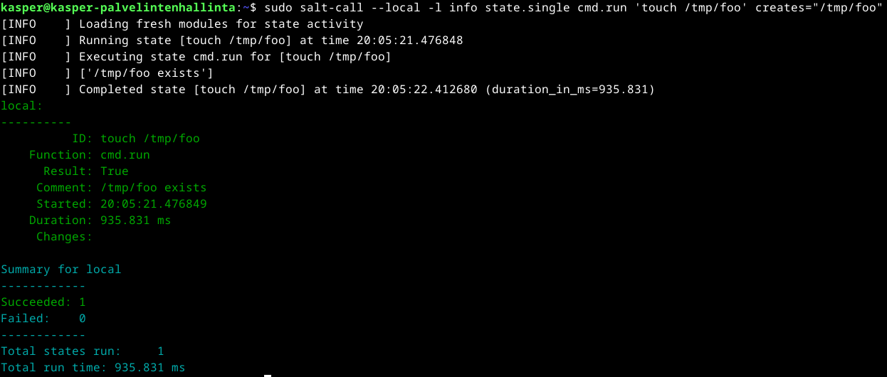

# h1 Viisikko

## Rauta & HostOS

- Asus X570 ROG Crosshair VIII Dark Hero AM4
- AMD Ryzen 5800X3D
- G.Skill DDR4 2x16gb 3200MHz CL16
- 2x SK hynix Platinum P41 2TB PCIe NVMe Gen4
- Sapphire Radeon RX 7900 XT NITRO+ Vapor-X
- Windows 11 Home 24H2

**Tehtävän aloitusaika 28.3.2025 kello 18:30.**

## x) Lue ja tiivistä

### Run Salt Command Locally
- Salt-komentoja voidaan suorittaa paikallisesti, jolla nähdään tuloksia heti. Hyödyllistä etenkin harjoitteluun, testaamiseen sekä nopeaan asennukseen.
- Samat Salt-komennot toimivat niin Linuxissa kuin Windowsissakin.
- Artikkelissa mainitaan viisi tärkeintä Salt-komentoa
- pkg, millä hallitaan paketteja
- file, millä hallitaan tiedostoja
- service, millä hallitaan palveluja
- user, millä hallitaan käyttäjiä
- cmd, millä suoritetaan komentoja

(Karvinen 2021)

### Salt Quickstart – Salt Stack Master and Slave on Ubuntu Linux
- Artikkelissa käsitellään Salt Master ja Salt Minion käyttöönottoa
- Master hallitsee Slaven tietokoneita, vaikka ne olisi eri verkossa
- Slaven avain on hyväksyttävä Masterilla, jotta yhteys toimii

(Karvinen 2018)

### Raportin kirjoittaminen
- Raportin tulee olla täsmällinen ja toistettava. Raportissa tulee atkiivisesti kertoa mitä teit ja mitä tapahtui. Raporttia on hyvä kirjoittaa jo työtä tehdessä.
- Raportissa olisi hyvä myös sisällyttää ympäristö, jossa työ tehtiin, koska monet asiat ja mahdolliset ongelmat toimivat sekä ilmenevät eri tavalla tietokoneissa ja verkoissa.
- Kirjoita menneessä aikamuodossa ja kerro tarkasti, mitä komentoja annoit tai mitä klikkasit. Raportoi kaikki tulokset ja mahdolliset viat ohjelmissa, työkaluissa ja laitteissa.
- Raportin tulee olla helppolukuinen. Käytä väliotsikoita, kirjoita selkeää kieltä ja viittaa mahdollisiin lähteisiin.
- Vältä sepittämistä, plagiointia ja kuvien luvatonta käyttöä.
  
(Karvinen 2006; Nurminen 2024)

### Salt Install Guide: Linux (DEB)
- Debianille Saltia asentaessa pitää luoda uusi pakettivarasto asentamista varten
- Asennusta varten pitää luoda keyrings kansio ja hakea sille Saltin julkinen avain
- Pakettivaraston haettua pitää päivittää pakettilista
- Tämän jälkeen asennetaan tarvittavat Salt-komponentit, kuten salt-minion tai salt-master

(VMware 2025)

## a) Asenna Debian 12-Bookworm virtuaalikoneeseen
Debian 12 asennettu virtuaalikoneeseen. Lisäksi päivitetty kaikki ohjelmat, otettu käyttöön palomuuri ja asennettu Virtualbox Guest Additions. Ei ongelmia asennuksessa.

## b) Asenna Salt
Salt asennusta varten oli tarve hakea uudet pakettivarastot asentamista varten. Tämän ensimmäinen vaihe oli luoda *keyrings* kansio ja hakea julkinen avain.

Seuraavaksi piti hakea itse pakettivarasto ja sen configuraatiot.

Paketit päivittelemällä saatiin uuden pakettivaraston metadatat ajatasalle.

Tämän jälkeen päästiinkin asentamaan itse vaadittu Salt-minion.

Testataan vielä, että Salt-minion asentui onnistuneesti tarkastamalla versiota.

(VMWare 2025)

## c) Viisi tärkeintä

### pkg
Saltin pkg hallitsee asennettavia ohjelmistopaketteja, joten sillä voidaan asentaa, päivittää tai poistaa paketteja. Testasin sitä asentamalla tree paketin komennolla **pkg.installed**.

Tree paketti asennettu onnistuneesti. Seuraavaksi testasin vielä toimintaa.

Toimii onnistuneesti, seuraavaksi vielä testasin poistaa paketin komennolla **pkg.removed** ja sekin onnistui ongelmitta.

(Karvinen 2021)

### file
Saltin File hallitsee tiedostoja. Kokeilin tätä luomalla ja poistamalla tiedostoja. Aluksi loin tyhjän tiedoston nimeltä hellotero komennolla **file.managed**.

Tämän jälkeen loin vielä moitero tiedoston, mihin lisättiin teksti foo ja kun sen toimintaa testattiin cat komennolla, nähdään sisältö onnistuneesti.

Lopuksi poistin vielä hellotero tiedoston komennolla **file.absent**.

(Karvinen 2021)

### service
Saltin service komento hallitsee palveluprosesseja (Daemoneja). Testissäni oli apache2 ja aloitetaan käynnistämällä se komennolla **service.running**.

Ei lähtenytkään käyntiin, koska apachea ei ole asennettuna. Joten seuraavaksi asensin sen. 

Testatessa uudestaan alkuperäistä käynnistyskomentoa, lähti se asentamisen jälkeen toimimaan **service.running** komennolla.

Toimintaa testattu vielä selaimessa localhost sivustolla.

Lopulta sammutin prosessin **service.dead** komennolla ja testasin, että se todellakin sammui.

(Karvinen 2021)

### user
Saltin user komento hallitsee käyttäjiä, esimerkissä aloitetaan luomalla käyttäjä terote08 komennola **user.present**

Kuten cat komennolla nähdään, kotihakemistoon on luotu uusi käyttäjä terote08.

Lopuksi poistin käyttäjän terote08 komennolla **user.absent**.

(Karvinen 2021)

### cmd
cmd komento hallitsee komentojen suorittamista ja sitä voidaan käskeä suoriutumaan tietyissä olosuhteissa. Käytännössä **cmd.run** toimii esimerkiksi tapauksissa, missä halutaan ettei toimintoa suoriteta vahingossa useaan kertaan. Kokeilin tätä suorittamalla touch /tmp/foo komennon joka luo tyhjän tiedoston, jos sitä ei ole olemassa.

Ja kun ajetaan sama komento uudestaan, tulee ilmoitus, että tiedosto on jo olemassa.

(Karvinen 2021; VMware 2025)

## d) Idempotentti
Saltin idempotenssi ilmenee suorittaessa samoja komentoja useaan kertaan, millä nähdään ettei ne tee turhia muutoksia, jos annettu komento on jo halutussa tilassa. Havainnoin tätä suorittamalla aluksi **service.running** komennon joka käynnistää apache2 palvelun.

Ja kun sama komento ajetaan heti perään uudestaan nähdään, että suoritusaika on lyhyt ja mitään muutoksia ei tehty sillä apache2 on jo käynnissä.

Havainnoin vielä samaa suorittamalla **pkg.installed** komennon, millä asennettiin tree paketti.

Ja kun suoritetaan jälleen sama komento uudestaan, nähdään saman kaavan toistuvan.

(Karvinen 2021; VMware 2025)

**Tehtävän lopetusaika 28.3.2025 kello 20:40. Aktiivista työskentelyä yhteensä noin 2 tuntia.**

## Lähteet
Karvinen T 2025. h1 Viisikko. Tero Karvisen verkkosivut. Luettavissa: https://terokarvinen.com/palvelinten-hallinta/ Luettu 28.03.2025

Karvinen T 2006. Raportin kirjoittaminen. Tero Karvisen verkkosivut. Luettavissa: https://terokarvinen.com/2006/06/04/raportin-kirjoittaminen-4/ Luettu 18.01.2024

Kasper Nurminen 2024. Linux Palvelimet - H1 Oma Linux. GitHub verkkosivut. Luettavissa: https://github.com/nurminenkasper/Linux-palvelimet/blob/main/h1-oma-linux.md Luettu 28.3.2025

VMware, Inc 2025. Salt install guide, Linux (DEB). Salt Project verkkosivut. Luettavissa: https://docs.saltproject.io/salt/install-guide/en/latest/topics/install-by-operating-system/linux-deb.html Luettu 28.3.2025

Karvinen T 2021. Run Salt Command Locally. Tero Karvisen verkkosivut. Luettavissa: https://terokarvinen.com/2021/salt-run-command-locally/ Luettu 28.3.2025

Karvinen T 2018. Salt Quickstart. Taro Karvisen verkkosivut. Luettavissa: https://terokarvinen.com/2018/03/28/salt-quickstart-salt-stack-master-and-slave-on-ubuntu-linux/ Luettu 28.3.2025

VMware, Inc 2025. SALT.STATES.CMD. Salt Project verkkosivut. Luettavissa: https://docs.saltproject.io/en/3006/ref/states/all/salt.states.cmd.html Luettu 28.3.2025

VMware, Inc 2025. Glossary. Salt Project verkkosivut. Luettavissa: https://docs.saltproject.io/en/3006/glossary.html Luettu 28.3.2025
