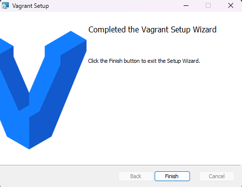
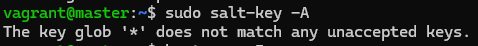
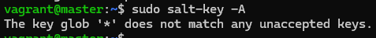

# h2 Soitto kotiin

## Rauta & HostOS

- Asus X570 ROG Crosshair VIII Dark Hero AM4
- AMD Ryzen 5800X3D
- G.Skill DDR4 2x16gb 3200MHz CL16
- 2x SK hynix Platinum P41 2TB PCIe NVMe Gen4
- Sapphire Radeon RX 7900 XT NITRO+ Vapor-X
- Windows 11 Home 24H2

**Tehtävän aloitusaika XX.4.2025 kello XXXX.**

## x) Lue ja tiivistä

### Karvinen 2021: Two Machine Virtual Network With Debian 11 Bullseye and Vagrant

### Karvinen 2018: Salt Quickstart – Salt Stack Master and Slave on Ubuntu Linux

### Karvinen 2023: Salt Vagrant - automatically provision one master and two slaves

#### Infra as Code - Your wishes as a text file

#### top.sls - What Slave Runs What States

## a) Hello Vagrant!
Windowsilla suoritettiin tehtäviä niin hain asennusmedian Vagrantin sivustolta ja kliksuttelin netxiä, kunnes saatiin ohjelma asennettua.

cmd auki ja testiin, mahtoiko asennus onnistua ja onnistuihan se.

## b) Linux Vagrant
Windows cmd käyntiin ja uutta Vagrant virtuaalikonetta varten loin uuden kansion ja ajoin sinne sisään **vagrant init debian/bookworm64** komennolla uuden Debian-virtuaalikoneen.

Tämän jälkeen pyöräytettiin luotu virtuaalikone käyntiin **vagrant up** komennolla ja hyvinnhän se lähti rullaamaan. VirtualBoxin puolelta nähdään myös, miten uusi kone löytyy luotuna.

**vagrant ssh** komennolla virtuaalikone käyttöön ja testiksi vielä pingaus googlen osoitteeseen, niin nähdään sen toimivan moitteitta.

Perään vielä **exit** millä poistuttiin virtuaalikoneesta ja kansiorakenteessa **vagrant destroy** sillä mitään tarvetta säilyttää kyseistä virtuaalikonetta ei ollut.

## c) Kaksin kaunihimpi
Kahta Linux-virtuaalikonetta uusi kansiorakenne ja sinne Debian rakentaminen komennolla **vagrant init debian/bookworm64**

[Teron sivusolta](https://terokarvinen.com/2021/two-machine-virtual-network-with-debian-11-bullseye-and-vagrant/) löytyvä Vagrantfile tiedoston konfiguraatio sisään, poikkeuksena toki se, että vm.box oli vaihdettava tämän hetkiseen debian/bookworm64 versioon.

Virtuaalikoneet päälle **vagrant up** komennolla.

Testailin vielä, että koneet saavat varmasti yhteyden toisiinsa. Availin ensin **vagrant ssh t001** komennolla t001 koneen ja tarkastelin vielä ip osoitteen varmuudeksi, vaikka se käytännössä oli jo tiedossa konfiguraatiotideoista. Siirryin seuraavaksi t002 puolelle **vagrant ssh t002** komennolla ja pingasin sieltä t001 koneen ip-osoitetta onnistuneesti. Testailin vielä, että toimiiko yhteys muuallekkin verkkoon pingaamalla googlen osoitetta.

Hommat paketissa, joten tuhotaan jälleen ylimääräiset virtuaalikoneet komennolla **vagrant destroy**

## d) Herra-orja verkossa
Seuraavaa tehtävää varten kansiorakenne pysyi samana, mutta **vagrantfile** oli hieman muokattava sopivammaksi. Kävin muokkaamassa nimiksi master ja slave, vaikka ei tämäkään toki niinkään tarpeellinen vaihe olisi, mutta tehtävän kannalta ihan mielenkiintoinen vaihdos.

Virtuaalikoneet käyntiin **vagrant up** komennolla

**vagrant ssh master** komennolla sisään ja ensimmäisenä hommana oli asennella Salt, mutta sitä varten oli tarpeellista rakentaa luottamussuhde Salt Project repon kanssa.

Luottamussuhteen rakentamisen jälkeen master koneelle asentelin **salt-master** version ohjelmistosta.

**vagrant ssh slave** komennolla sisään slave koneen puolelle ja sama luottamussuhteen rakentaminen käyntiin.

Lopulta asentelin **salt-minion** version slave-virtuaalikoneelle.

Slave koneen puolelle **sudoedit /etc/salt/minion** ja sinne lisäilemään master koneen IP-osoite sekä Slave ID tunnistamista varten. Loppuun vielä **sudo systemctl restart salt-minion.service** niin saatiin uudet asetukset käyttöön.

Takaisin master koneen puolelle tarkoituksena hyväksyä orjan avainpyyntö **sudo salt-key -A** komennolla

Mitä ihmettä, ei toiminut? Suuntasin takaisin Slave virtuaalikoneen /etc/salt/minion tiedostoon muokkaamaan ja otin alkuun id kohdan pois, jos se olisi ongelma? Demonin uudelleenkäynnistys perään.

Uusi yritys Master puolella tuotti kuitenkin edelleen samaa virhettä.

Takaisin tiedoston pariin kokeilemaan eri IP-osoitetta ja lisäisin id kohdan takaisin samalla, koska se ei selvästi ollut ongelmana. Demonin uudelleenkäynnistys perään. 

Bah, samaa virhettä tuottaa edelleen. Testailin vielä ping komennolla, toimiiko varmasti yhteys koneiden välillä.

Se kun toimi niin rupesin hieman googlaamaan ja törmäsin Reddit postaukseen, missä salt-master ei ollut päällä joten tarkistelin sitäkin omalta osalta. **sudo systemctl status salt-master** antoikin palautetta heti ettei ole päällä joten käynnistus perään **sudo systemctl start salt-master** komennolla. 

Joko nyt lähtisi avaimen hyväksyntä toimimaan?

[K32](32.png)

Vihdoin! Testailin vielä muutamalla komennolla, että toimiihan orjan komentaminen.

## e) Kokeile vähintään kahta tilaa verkon yli

**Tehtävän lopetusaika XX.4.2025 kello XXXX. Aktiivista työskentelyä yhteensä noin X tuntia XX minuuttia.**

## Lähteet
Karvinen T 2025. h1 Soitto kotiin. Tero Karvisen verkkosivut. Luettavissa: https://terokarvinen.com/palvelinten-hallinta/ Luettu 3.4.2025
