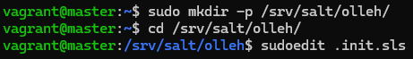
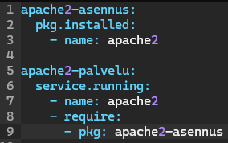
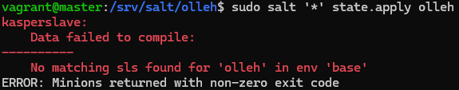
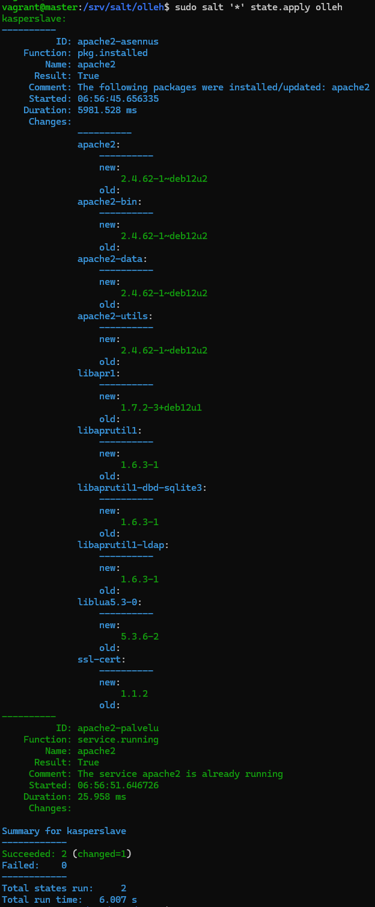
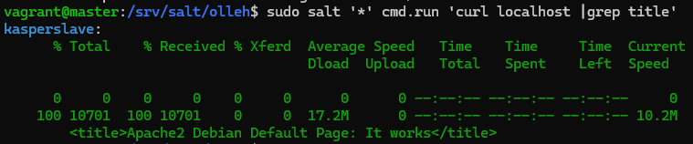
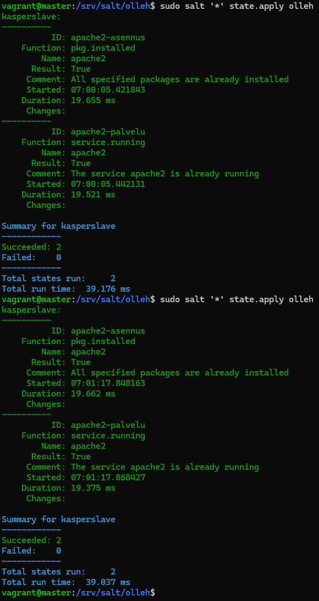

# h2 Infraa koodina

## Rauta & HostOS

- Asus X570 ROG Crosshair VIII Dark Hero AM4
- AMD Ryzen 5800X3D
- G.Skill DDR4 2x16gb 3200MHz CL16
- 2x SK hynix Platinum P41 2TB PCIe NVMe Gen4
- Sapphire Radeon RX 7900 XT NITRO+ Vapor-X
- Windows 11 Home 24H2

**Tehtävän aloitusaika 12.4.2025 kello 08:45**

## x) Lue ja tiivistä

### Karvinen 2024: Hello Salt Infra-as-Code
- Artikkelissa käydään läpi Salt Infra-as-Code, eli suoritetaan komentoja valmiin tiedoston kautta
- /srv/salt on minionien kanssa jettu kansio, mihin lisätään ajettava infrakoodi
- init.sls sisältää projektin koodin ja sitä voidaan ajaa state.apply komennolla niin lokaalisti kuin minioneillakin

(Karvinen 2024)
### Salt contributors: Salt overview

#### Rules of YAML
- YAMLia käytetään usein Salt tiedostojen renderöinnissä
- Data muodostetaan pareissa, esim muodossa avain: arvo
- Kirjainkoolla on merkitystä tekstissä
- Tabulaattori ei toimi YAML koodissa, vaan on käytettävä välilyöntejä

#### YAML simple structure
- YAMLilla on kolme tyypillistä peruselementtiä
- Scalar, avain:arvo pari, missä voi olla numeroita, merkkijonoja tai boolean arvoja
- List, avain: jonka jälkeen voi olla arvoja ja ne voidaan erotella riveillä/väliviivalla
- Dictionary, avain: arvo kokoelma

#### Lists and dictionaries - YAML block structures
- YAML on organisoitu lohkoiksi rakenteeltaan
- Sisennyksellä määrätään asian yhteys
- Kokoelma joka on list tai dictionary, jokainen rivi muodostetaan välillä tai viivalla

(Salt Project 2025)
## a) Hei infrakoodi!
Testasin infraa koodina virtuaalikoneella, jossa oli valmiiksi jo salt-minion asennettuna. Homma alkuun luomalla hello kansion, suuntaamalla sinne ja luomalla sinne init.sls tiedoston mihin itse infrakoodi kirjoitetaan.

        sudo mkdir -p /srv/salt/hello/
        cd /srv/salt/hello/
        sudoedit init.sls

init.sls tiedostoon lisäsin Saltin omalla kielellä koodiksi seuraavan koodin:

        /tmp/hellokasper:
          file.managed

Seuraavaksi ajoin luotua tiedostoa paikallisesti. Komennon tarkoitushan on luoda tiedosto hellokasper.

        sudo salt-call --local state.apply hello

Suoritteessa lukee, että uusi tiedosto on luoto. Tarkastellaan vielä onnistuiko varmasti?

        ls /tmp/hellokasper

(Karvinen 2024)

## b) Aja esimerkki sls-tiedostosi verkon yli orjalla
Verkon yli ajamista varten oli tarvetta luoda jälleen **master** ja **slave** koneet hyödyntäen [edellisen kerran oppeja](https://github.com/nurminenkasper/Palvelinten-Hallinta/blob/main/h2/h2-Soitto-kotiin.md). Tehtävään sopiva vagrantfile oli jo valmiina, joten käynnistelin suoraan koneet, loin luottamussuhteen Salt asennusta varten, asensin salt-master ja salt-minion versiot, minionille masterin IP-osoite ja lopulta avain hyväksyntään masterin puolella.

        vagrant up
        vagrant ssh master
        sudo apt-get update
        sudo apt-get install curl
        mkdir -p /etc/apt/keyrings
        curl -fsSL https://packages.broadcom.com/artifactory/api/security/keypair/SaltProjectKey/public | sudo tee /etc/apt/keyrings/salt-archive-keyring.pgp
        curl -fsSL https://github.com/saltstack/salt-install-guide/releases/latest/download/salt.sources | sudo tee /etc/apt/sources.list.d/salt.sources
        sudo apt-get update
        sudo apt-get install salt-master
        exit
        vagrant ssh minion
        sudo apt-get update
        sudo apt-get install curl
        mkdir -p /etc/apt/keyrings
        curl -fsSL https://packages.broadcom.com/artifactory/api/security/keypair/SaltProjectKey/public | sudo tee /etc/apt/keyrings/salt-archive-keyring.pgp
        curl -fsSL https://github.com/saltstack/salt-install-guide/releases/latest/download/salt.sources | sudo tee /etc/apt/sources.list.d/salt.sources
        sudo apt-get update
        sudo apt-get install salt-minion
        sudoedit /etc/salt/minion
        master: 192.168.88.101
        id: kasperslave
        sudo systemctl restart salt-minion.service
        exit
        vagrant ssh master
        sudo systemctl start salt-master.service
        sudo salt-key -A

Luodaan jälleen init.sls tiedosto, mihin koodi kirjoitetaan samalla tavalla kuin tehtävässä a)

        sudo mkdir -p /srv/salt/hello/
        cd /srv/salt/hello/
        sudoedit init.sls
        
        /tmp/hellokasper:
          file.managed

Tällä kertaa kuitenkin tarkoituksena ajaa komento slave koneella, joten hyödynnetään '*' kohdentamaan kaikki minionit, eli tässä tapauksessa yksi pystyssä oleva kasperslave.

        sudo salt '*' state.apply hello

Ensimmäinen yritys reisille, koska annetussa koodissa on virhe. Tarkemmalla tarkastelulla oli päässyt lipsahtamaan ylimääräinen välilyönti, joten korjataan se ja ajetaan uudestaan.

Tällä kertaa onnistunut ajo! Testasin kuitenkin vielä hyödyntäen cmd.run komentoa, että oliko lopputulos onnistunut.

        sudo salt '*' cmd.run 'ls /tmp/hellokasper'

(Salt Project 2025; Karvinen 2018, 2024, 2025; Nurminen 2025)

## c) Tee sls-tiedosto, joka käyttää vähintään kahta eri tilafunktiota. Tarkista eri ohjelmalla, että lopputulos on oikea. Osoita useammalla ajolla, että sls-tiedostosi on idempotentti.
Tehtävää varten loin edellisten oppien pohjalta uuden sls-tiedoston ja aloin luomaan koodia sinne. Tavoitteeksi otin asentaa ja käynnistää apache2 minionin ja siihen löytyikin ihan hyvät ohjeet suoraan [Salt Projectin sivuilta](https://docs.saltproject.io/salt/user-guide/en/latest/topics/states.html#create-the-apache-state).

        sudo mkdir -p /srv/salt/olleh/
        cd /srv/salt/olleh/
        sudoedit .init.sls

Koodiksi lisäilin sisälle apache2-asennuksen sekä apache2-palvelun. Tässä tapauksessa siis hyödynnetään pkg sekä service komentoja. 

        apache2-asennus:
          pkg.installed:
            - name: apache2

        apache2-palvelu:
          service.running:
            - name: apache2
            - require:
              - pkg: apache2-asennus

Koodiin lisäsin siis ihan tyypillisen apache2 asennuksen, mutta lisäsin vielä service komentoon linjan, että pkg on suoritettava ennen service toimintoa, jotta apache2 on varmasti mahdollista käynnistää.

Ajellaan seuraavaksi komento.

        sudo salt '*' state.apply olleh

Oho, mikäs virhe tämä on? Piti hetken aikaa pyöritellä googlea vastausta löytämättä, mutta lopulta päädyin kysymään Gemini 2.0 tekoälyltä joka osasi sanoa heti, että tiedoston nimeksi oli ajatuksissa päätynyt **.**init.sls eikä init.sls, joten muutetaan se oikeaan muotoon.

        sudo mv .init.sls init.sls

Tämän jälkeen uusi ajo komennolle.

Tällä kertaa täysin onnistunut suoritus! Tarkastellaan vielä, että asentuiko ja käynnistyikö apache2 hyödyntäen cmd.run komentoa.

        sudo salt '*' cmd.run 'curl localhost |grep title'

Kasperslave ilmoitteleepi, että Apache2 pyörii ongelmitta! Testataan vielä, että onhan luomani sls-tiedosto varmasti idempotentti ajamalla se uudestaan kahteen kertaan.

Siltähän se näyttää. Ajo tapahtuu uudestaan, mutta ajo ei aiheuttanut mitään muutoksia järjestelmään.

(Salt Project 2025; Karvinen 2018, 2024, 2025)

**Tehtävän lopetusaika 12.4.2025 kello 11:05. Aktiivista työskentelyä yhteensä noin 2 tuntia 25 minuuttia.**

## Lähteet
Karvinen T 2025. h3 Infraa koodina. Tero Karvisen verkkosivut. Luettavissa: https://terokarvinen.com/palvelinten-hallinta/ Luettu 12.4.2025

Karvinen T 2024. Hello Salt Infra-as-Code. Tero Karvisen verkkosivut. Luettavissa: https://terokarvinen.com/2024/hello-salt-infra-as-code/ Luettu 12.4.2025

Salt Project 2025. Rules of YAML. Luettavissa: https://docs.saltproject.io/salt/user-guide/en/latest/topics/overview.html#rules-of-yaml Luettu 12.4.2025

Nurminen K 2025. GitHub. Luettavissa: https://github.com/nurminenkasper/Palvelinten-Hallinta/blob/main/h2/h2-Soitto-kotiin.md Luettu 12.4.2025

Salt Project 2025. Salt Install Guide. Luettavissa: https://docs.saltproject.io/salt/install-guide/en/latest/topics/install-by-operating-system/linux-deb.html Luettu 12.4.2025

Salt Project 2025. Salt User Guide - Create the Apache state. Luettavissa: https://docs.saltproject.io/salt/user-guide/en/latest/topics/states.html#create-the-apache-state Luettu 12.4.2025

Salt Project 2025. Salt User Guide - Requisite declarations. Luettavissa: https://docs.saltproject.io/salt/user-guide/en/latest/topics/requisites.html Luettu 12.4.2025

Karvinen T 2018. Salt Quickstart. Luettavissa: https://terokarvinen.com/2018/salt-quickstart-salt-stack-master-and-slave-on-ubuntu-linux/ Luettu 12.4.2025
