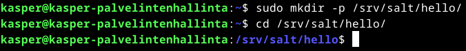
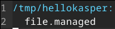
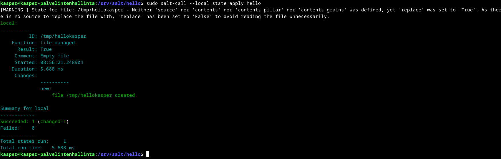
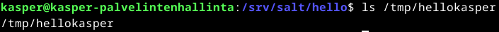

# h2 Infraa koodina

## Rauta & HostOS

- Asus X570 ROG Crosshair VIII Dark Hero AM4
- AMD Ryzen 5800X3D
- G.Skill DDR4 2x16gb 3200MHz CL16
- 2x SK hynix Platinum P41 2TB PCIe NVMe Gen4
- Sapphire Radeon RX 7900 XT NITRO+ Vapor-X
- Windows 11 Home 24H2

**Tehtävän aloitusaika 12.4.2025 kello 08:45**

## x) Lue ja tiivistä

### Karvinen 2014: Hello Salt Infra-as-Code

### Salt contributors: Salt overview

#### Rules of YAML

#### YAML simple structure

#### Lists and dictionaries - YAML block structures

## a) Hei infrakoodi!
Testasin infraa koodina virtuaalikoneella, jossa oli valmiiksi jo salt-minion asennettuna. Homma alkuun luomalla hello kansion, suuntaamalla sinne ja luomalla sinne init.sls tiedoston mihin itse infrakoodi kirjoitetaan.

        sudo mkdir -p /srv/salt/hello/
        cd /srv/salt/hello/
        sudoedit init.sls

init.sls tiedostoon lisäsin Saltin omalla kielellä koodiksi seuraavan koodin:

        /tmp/hellokasper:
          file.managed

Seuraavaksi ajoin luotua tiedostoa paikallisesti. Komennon tarkoitushan on luoda tiedosto hellokasper.

        sudo salt-call --local state.apply hello

Suoritteessa lukee, että uusi tiedosto on luoto. Tarkastellaan vielä onnistuiko varmasti?

        ls /tmp/hellokasper

(Karvinen 2024)

## b) Aja esimerkki sls-tiedostosi verkon yli orjalla

## c) Tee sls-tiedosto, joka käyttää vähintään kahta eri tilafunktiota. Tarkista eri ohjelmalla, että lopputulos on oikea. Osoita useammalla ajolla, että sls-tiedostosi on idempotentti.

**Tehtävän lopetusaika 4.4.2025 kello 23:10. Tauko välillä 16:00-21:00. Aktiivista työskentelyä yhteensä noin 5 tuntia 40 minuuttia.**

## Lähteet
Karvinen T 2025. h3 Infraa koodina. Tero Karvisen verkkosivut. Luettavissa: https://terokarvinen.com/palvelinten-hallinta/ Luettu 12.4.2025
