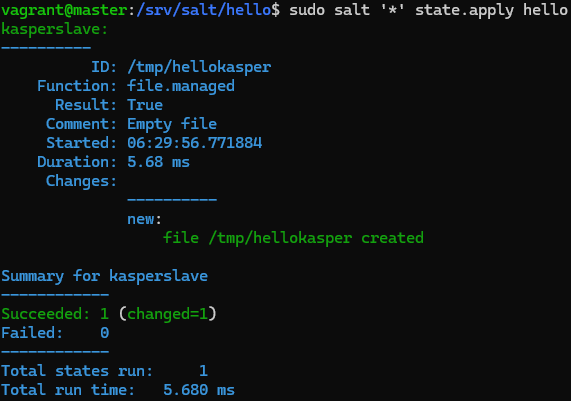

# h2 Infraa koodina

## Rauta & HostOS

- Asus X570 ROG Crosshair VIII Dark Hero AM4
- AMD Ryzen 5800X3D
- G.Skill DDR4 2x16gb 3200MHz CL16
- 2x SK hynix Platinum P41 2TB PCIe NVMe Gen4
- Sapphire Radeon RX 7900 XT NITRO+ Vapor-X
- Windows 11 Home 24H2

**Tehtävän aloitusaika 12.4.2025 kello 08:45**

## x) Lue ja tiivistä

### Karvinen 2014: Hello Salt Infra-as-Code

### Salt contributors: Salt overview

#### Rules of YAML

#### YAML simple structure

#### Lists and dictionaries - YAML block structures

## a) Hei infrakoodi!
Testasin infraa koodina virtuaalikoneella, jossa oli valmiiksi jo salt-minion asennettuna. Homma alkuun luomalla hello kansion, suuntaamalla sinne ja luomalla sinne init.sls tiedoston mihin itse infrakoodi kirjoitetaan.

        sudo mkdir -p /srv/salt/hello/
        cd /srv/salt/hello/
        sudoedit init.sls

init.sls tiedostoon lisäsin Saltin omalla kielellä koodiksi seuraavan koodin:

        /tmp/hellokasper:
          file.managed

Seuraavaksi ajoin luotua tiedostoa paikallisesti. Komennon tarkoitushan on luoda tiedosto hellokasper.

        sudo salt-call --local state.apply hello

Suoritteessa lukee, että uusi tiedosto on luoto. Tarkastellaan vielä onnistuiko varmasti?

        ls /tmp/hellokasper

(Karvinen 2024)

## b) Aja esimerkki sls-tiedostosi verkon yli orjalla
Verkon yli ajamista varten oli tarvetta luoda jälleen **master** ja **slave** koneet hyödyntäen [edellisen kerran oppeja](https://github.com/nurminenkasper/Palvelinten-Hallinta/blob/main/h2/h2-Soitto-kotiin.md). Tehtävään sopiva vagrantfile oli jo valmiina, joten käynnistelin suoraan koneet, loin luottamussuhteen Salt asennusta varten, asensin salt-master ja salt-minion versiot, minionille masterin IP-osoite ja lopulta avain hyväksyntään masterin puolella.

        vagrant up
        vagrant ssh master
        sudo apt-get update
        sudo apt-get install curl
        mkdir -p /etc/apt/keyrings
        curl -fsSL https://packages.broadcom.com/artifactory/api/security/keypair/SaltProjectKey/public | sudo tee /etc/apt/keyrings/salt-archive-keyring.pgp
        curl -fsSL https://github.com/saltstack/salt-install-guide/releases/latest/download/salt.sources | sudo tee /etc/apt/sources.list.d/salt.sources
        sudo apt-get update
        sudo apt-get install salt-master
        exit
        vagrant ssh minion
        sudo apt-get update
        sudo apt-get install curl
        mkdir -p /etc/apt/keyrings
        curl -fsSL https://packages.broadcom.com/artifactory/api/security/keypair/SaltProjectKey/public | sudo tee /etc/apt/keyrings/salt-archive-keyring.pgp
        curl -fsSL https://github.com/saltstack/salt-install-guide/releases/latest/download/salt.sources | sudo tee /etc/apt/sources.list.d/salt.sources
        sudo apt-get update
        sudo apt-get install salt-minion
        sudoedit /etc/salt/minion
        master: 192.168.88.101
        id: kasperslave
        sudo systemctl restart salt-minion.service
        exit
        vagrant ssh master
        sudo systemctl start salt-master.service
        sudo salt-key -A

Luodaan jälleen init.sls tiedosto, mihin koodi kirjoitetaan samalla tavalla kuin tehtävässä a)

        sudo mkdir -p /srv/salt/hello/
        cd /srv/salt/hello/
        sudoedit init.sls
        
        /tmp/hellokasper:
          file.managed

Tällä kertaa kuitenkin tarkoituksena ajaa komento slave koneella, joten hyödynnetään '*' kohdentamaan kaikki minionit, eli tässä tapauksessa yksi pystyssä oleva kasperslave.

        sudo salt '*' state.apply hello

Ensimmäinen yritys reisille, koska annetussa koodissa on virhe. Tarkemmalla tarkastelulla oli päässyt lipsahtamaan ylimääräinen välilyönti, joten korjataan se ja ajetaan uudestaan.

Tällä kertaa onnistunut ajo! Testasin kuitenkin vielä hyödyntäen cmd.run komentoa, että oliko lopputulos onnistunut.

        sudo salt '*' cmd.run 'ls /tmp/hellokasper'

## c) Tee sls-tiedosto, joka käyttää vähintään kahta eri tilafunktiota. Tarkista eri ohjelmalla, että lopputulos on oikea. Osoita useammalla ajolla, että sls-tiedostosi on idempotentti.

**Tehtävän lopetusaika 12.4.2025 kello XXX.  Aktiivista työskentelyä yhteensä noin XX tuntia XX minuuttia.**

## Lähteet
Karvinen T 2025. h3 Infraa koodina. Tero Karvisen verkkosivut. Luettavissa: https://terokarvinen.com/palvelinten-hallinta/ Luettu 12.4.2025
