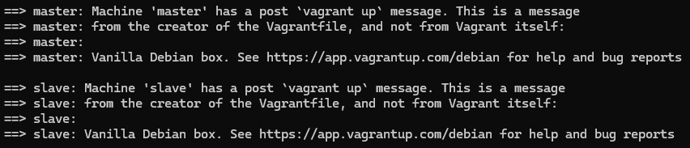

# h4 Pkg file service

## Rauta & HostOS

- Asus X570 ROG Crosshair VIII Dark Hero AM4
- AMD Ryzen 5800X3D
- G.Skill DDR4 2x16gb 3200MHz CL16
- 2x SK hynix Platinum P41 2TB PCIe NVMe Gen4
- Sapphire Radeon RX 7900 XT NITRO+ Vapor-X
- Windows 11 Home 24H2

**Tehtävän aloitusaika 19.4.2025 kello 15:30**

## x) Lue ja tiivistä

### Karvinen 2018: Pkg-File-Service – Control Daemons with Salt – Change SSH Server Port

## a) Apache easy mode.
Tavoitteena on asentaa Apache2, ensin käsin ja sen jälkeen automaattisesti Salt hyödyntäen. Tätä varten luonnollisesti tarvitaan alusta millä suorittaa, niin käynnistelin jo edellisissä tehtävissä käytettyjä Vagrant master & slave koneita.

Kirjauduttua **master** koneelle muistelin, että viime kerran tehtävissä asensin orjalle juuri Apache2 joten tarkistelin sitä alkuun.

Vaihdoin **slave** koneelle, koska tarkoituksena oli testata ensin käsin. Varmistin vielä, että olihan Apache2 varmasti asennettu ja toiminnassa.

Vaihdoin Apache2 oletussivun omaan versioon ja testasin.

Tämän jälkeen olikin varmasti tarpeellista poistaa käsin tehty, jotta voidaan toteuttaa automaatiota Master koneelta Saltin yli.

Kirjautuminen takaisin **master** koneelle ja alkuun oli tarpeellista luoda edellisistä tehtävistäkin tutulla tavalla kansiorakenne ja sinne init.sls tiedosto.

        sudo mkdir -p /srv/salt/apache2
        cd /srv/salt/apache2
        sudoedit init.sls

Tein jo [edellisessä tehtävässä](https://github.com/nurminenkasper/Palvelinten-Hallinta/blob/main/h3/h3-Infraa-koodina.md) lähes vastaavan tyyppistä ratkaisua, joten lisäsin Apache2 init.sls tiedostoon automatisaatiota varten seuraavat asiat:

        apache2-asennus:
          pkg.installed:
            - name: apache2
            
        apache2-etusivu:
         file.managed:
           - name: /var/www/html/index.html
           - contents: |
               <h1>Orjan Testisivu</h1>
               
Tämä sivu on orjan testisivu.

           - require:
             - pkg: apache2-asennus

        apache2-palvelu:
          service.running:
            - name: apache2
            - require:
              - file: apache2-etusivu

Tällä tavalla saadaan:
-  `pkg.installed` joka vastaa Apache2 asentamiseta.
-  `file.managed` joka vastaa siitä, että index.html muutetaan oma sisältö
-  `service.running` joka vastaa apache2 käynnistämisestä

Laitetaan seuraavaksi käytäntöön. `sudo salt '*' state.apply apache2` suorittaa juuri tehdyn yhtälön kaikille orjille, tässä tapauksessa yhdelle olemassa olevalle kasperslave orjalle.

Curlataan vielä master koneelta Saltin yli localhostia, lähtikö homma toimimaan oikeasti.

Perään vielä kirjautuminen **slave** koneelle ja testaus, jotta saadaan tuplavarmistus asialle.

(Karvinen 2025; Nurminen 2025)
## b) SSHouto

**Tehtävän lopetusaika 19.4.2025 kello XXXX. Aktiivista työskentelyä yhteensä noin X tuntia XX minuuttia.**

## Lähteet
Karvinen T 2025. h3 Infraa koodina. Tero Karvisen verkkosivut. Luettavissa: https://terokarvinen.com/palvelinten-hallinta/#h4-pkg-file-service Luettu 19.4.2025

