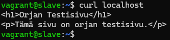
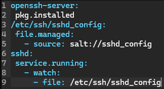
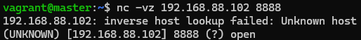
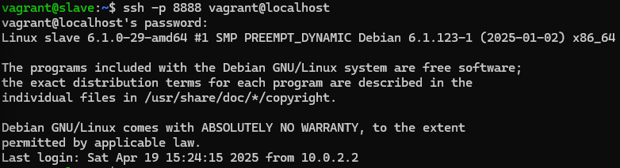

# h4 Pkg file service

## Rauta & HostOS

- Asus X570 ROG Crosshair VIII Dark Hero AM4
- AMD Ryzen 5800X3D
- G.Skill DDR4 2x16gb 3200MHz CL16
- 2x SK hynix Platinum P41 2TB PCIe NVMe Gen4
- Sapphire Radeon RX 7900 XT NITRO+ Vapor-X
- Windows 11 Home 24H2

**Tehtävän aloitusaika 19.4.2025 kello 15:30**

## x) Lue ja tiivistä

### Karvinen 2018: Pkg-File-Service – Control Daemons with Salt – Change SSH Server Port

## a) Apache easy mode.
Tavoitteena on asentaa Apache2, ensin käsin ja sen jälkeen automaattisesti Salt hyödyntäen. Tätä varten luonnollisesti tarvitaan alusta millä suorittaa, niin käynnistelin jo edellisissä tehtävissä käytettyjä Vagrant master & slave koneita.

Kirjauduttua **master** koneelle muistelin, että viime kerran tehtävissä asensin orjalle juuri Apache2 joten tarkistelin sitä alkuun.

Vaihdoin **slave** koneelle, koska tarkoituksena oli testata ensin käsin. Varmistin vielä, että olihan Apache2 varmasti asennettu ja toiminnassa.

Vaihdoin Apache2 oletussivun omaan versioon ja testasin.

Tämän jälkeen olikin varmasti tarpeellista poistaa käsin tehty, jotta voidaan toteuttaa automaatiota Master koneelta Saltin yli.

Kirjautuminen takaisin **master** koneelle ja alkuun oli tarpeellista luoda edellisistä tehtävistäkin tutulla tavalla kansiorakenne ja sinne init.sls tiedosto.

        sudo mkdir -p /srv/salt/apache2
        cd /srv/salt/apache2
        sudoedit init.sls

Tein jo [edellisessä tehtävässä](https://github.com/nurminenkasper/Palvelinten-Hallinta/blob/main/h3/h3-Infraa-koodina.md) lähes vastaavan tyyppistä ratkaisua, joten lisäsin Apache2 init.sls tiedostoon automatisaatiota varten seuraavat asiat:

        apache2-asennus:
          pkg.installed:
            - name: apache2
            
        apache2-etusivu:
         file.managed:
           - name: /var/www/html/index.html
           - contents: |
               <h1>Orjan Testisivu</h1>
               
Tämä sivu on orjan testisivu.

           - require:
             - pkg: apache2-asennus

        apache2-palvelu:
          service.running:
            - name: apache2
            - require:
              - file: apache2-etusivu

Tällä tavalla saadaan:
-  `pkg.installed` joka vastaa Apache2 asentamiseta.
-  `file.managed` joka vastaa siitä, että index.html muutetaan oma sisältö
-  `service.running` joka vastaa apache2 käynnistämisestä

Laitetaan seuraavaksi käytäntöön. `sudo salt '*' state.apply apache2` suorittaa juuri tehdyn yhtälön kaikille orjille, tässä tapauksessa yhdelle olemassa olevalle kasperslave orjalle.

Curlataan vielä master koneelta Saltin yli localhostia, lähtikö homma toimimaan oikeasti.

Perään vielä kirjautuminen **slave** koneelle ja testaus, jotta saadaan tuplavarmistus asialle.

(Karvinen 2025; Nurminen 2025)
## b) SSHouto
Kerta ollaan valmiiksi edellisestä tehtävästä jo **slave** koneella, testataan käsin ssh toimintaa. Tätä varten on tarpeellista asentaa itse ssh

`sudoedit /etc/ssh/sshd_config` avaa asetustiedot, mihin lisäilin tehtäväannon vinkkien mukaan 1234 portin lisäksi myös 22/tcp auki, koska se on Vagrant yhteyden portti.

Hommat käyntiin ja tarkastus, että lähti toimimaan.

`nc -vz localhost 1234` eli netcat kutsukomento ja -vz missä **v** tulostaa verbose viestin siitä onnistuiko yhteys vai ei ja **z** ei lähetä mitään dataa yhteyden muodostamisen yhteydessä.

Kuten näkyy, alkuun ei onnistunut, mutta päätin heti käynnistää vielä ssh uudestaan.

Nyt ainakin toimii, ehkä? Kokeillaan vielä kirjautua sisään **ssh -p** komennolla.

Erroria puskee, mutta onneksi syötteessä on ainakin komento millä jatkaa.

Uutta yritystä heti perään tulille.

Yhteys muuten onnistunut, mutta salasana mitä ajattelin olevan root salasana ei kyllä toimi. Varmistelin vielä netcatilla, onnistuuhan kutsu portille ja näyttääkö avointa?

Erikoista. Testasin vielä erilaisia kirjautumiskäyttäjiä ja tarkistinkin oikean `whoami` komennolla, mutta mikään ei tuntunut toimivan. Varmistin vielä senkin, että Vagrant salasana pitäisi olla oletuksena myös [**vagrant**](https://developer.hashicorp.com/vagrant/docs/boxes/base)

No joo, ei onnistu niin ei onnistu. ajattelin testata seuraavaksi Teron ohjeilla asiaa Saltin yli jos se lähtisi toimimaan paremmin. Tätä varten oli tarvetta poistaa kaikki ssh liittyvät paketit.

Samalla tavalla kuin aikasemmin Apache2 kanssa, luodaan tarpeellinen kansio ja luodaan sinne init.sls

        sudo mkdir -p /srv/salt/ssh
        cd /srv/salt/ssh
        sudoedit init.sls

Tällä kertaa sisään suoraan [Teron ohjeesta](https://terokarvinen.com/2018/04/03/pkg-file-service-control-daemons-with-salt-change-ssh-server-port/?fromSearch=karvinen%20salt%20ssh) ssh-state sls tiedosto, missä:

        openssh-server:
         pkg.installed
        /etc/ssh/sshd_config:
         file.managed:
           - source: salt://sshd_config
        sshd:
         service.running:
           - watch:
             - file: /etc/ssh/sshd_config

-  `pkg.installed` joka vastaa SSH asentamiseta.
-  `file.managed` joka vastaa siitä, että sshd_config muutetaan oikeaksi
-  `service.running` joka vastaa ssh käynnistämisestä ja watch komento käynnistää demonin uudelleen koska asetustiedosto muuttuu masterilla

Tosissaan, tarpeellista on muokata myös masterin sshd_config tiedoston sisältö oikein.

Tässä kohtaa itse tein virheen kopioimalla Teron ohjeistuksesta sshd_config tiedoston tiedot, mutta palataan tähän virheeseen vielä möyhemmin raportissa tarkemmin. Seuraavaksi suoritin Saltilla luodun setin.

En muistanut mikä on Slaven IP-osoite, jotta voisin testata toimiiko ssh yhteys. Tämähän selviää nopeasti käyttämällä cmd.run komentoa saltissa ja pyytämällä hostname -I komennolla osoitteet.

Testataan seuraavaksi, onko portti auki ja onnistuuko yhteys `nc -vz` komennolla.

Samalta näyttää kuin käsin tehtynä. Testataan seuraavaksi kirjautuminen käyttäen `ssh -p 8888 vagrant@192.168.88.102` komentoa.

Ei, Ei ja Ei. Samaa salasanaa vaatii ja mikään ei tunnu toimivan. Palataanpa takaisin **slave** koneen puolelle ja hoidetaan käsin toiminta ennen Salt yli toimimista niin saadaan parempi lopputulos. Tyhjensin seuraavaksi ssh asennukset slave koneelta.

Ja asensin perään takaisin tuoreena.

**sshd_config** tiedostosta poistin kaikki # merkinnät ja cat komennolla nähdään syöte. Tässä kohtaa myös kopioin kyseisen syötteen talteen, koska tajusin, että olihan se Tero kirjoittanutkin siitä miten on parempi käyttää omaa oikeaa SSH asetustiedoston siältöä eikä vanhan ohjeen sisältöä. Korjataan siis aikaisempaa virhettä, mistä oli puhetta.

Käynnistellään SSH.

Seuraavaksi vuorossa taas testaus, tällä kertaa portille 8888 minkä olin asettanut.

Ei luoja, samaa ongelmaa puskee. Googlettelin hetken aikaa ja yritin kysellä tekoälyltä, mutta kummastakin sai melko huonosti mitään tehtävän kannalta relevanttia. Ajattelin lopulta viimeisenä oljenkortena asettaa salasanan uudestaan.

Testi, toimiiko nyt?

**...**

Kertaheitolla sisään ilman mitään ongelmia. Exittiä, SSH poistaminen käsin ja kokeilemaan hommaa Saltin yli.

Hommathan oli **master** koneella käytännössä valmiina, mutta kävin vielä vaihtamassa sshd_config sisällön vastaamaan aikaisemmin kopioimaani sisältöä.

Suoritetaan Saltin yli orjakoneelle.

Näyttää onnistuneelta, jälleen. Testataan toimiiko?

Tämäpäs on tuttu virhe, no hoidellaan siihen liittyvät toimenpiteet syötteen ohjeen mukaan.

Kirjaudutaan ssh käyttäen sisään uudestaan, toimisiko nyt?

Toimii! Huh, olipas työmaa...

**Tehtävän lopetusaika 19.4.2025 kello XXXX. Aktiivista työskentelyä yhteensä noin X tuntia XX minuuttia.**

## Lähteet
Karvinen T 2025. h3 Infraa koodina. Tero Karvisen verkkosivut. Luettavissa: https://terokarvinen.com/palvelinten-hallinta/#h4-pkg-file-service Luettu 19.4.2025

