# h5 Miniprojekti

## Rauta & HostOS

- Asus X570 ROG Crosshair VIII Dark Hero AM4
- AMD Ryzen 5800X3D
- G.Skill DDR4 2x16gb 3200MHz CL16
- 2x SK hynix Platinum P41 2TB PCIe NVMe Gen4
- Sapphire Radeon RX 7900 XT NITRO+ Vapor-X
- Windows 11 Home 24H2

**Tehtävän aloitusaika 30.4.2025 kello 08:00**

## a) Oma miniprojekti
Tehtävää varten piti vähän mietiskellä, millaista projektia lähden toteuttamaan. Lopulta päädyin ratkaisuun, missä pystytän Saltin yli serverin Multiplayer Tetris klooninlle nimeltä [Netris](https://github.com/warmchang/netris). Tätä oli kuitenkin tarpeellista lähteä testaamaan ensin lokaalisti, että nähdään saadaanko se ylipäätänsä toimimaan. Aihe oli entuudestaan jo hieman tuttu, mikä helpotti lokaalia suorittamista.

Rakentelin Vagrantilla Master ja Slave koneet pystyyn. Alla olevaa Vagrantfileä hyödyntäen saadaan rakennettua koneet pystyyn niin, että Masterille jää jäljelle enään salt-avaimen hyväksyntä käynnistellessä.

```
$master_script = <<-MASTER_SCRIPT
set -o verbose
sudo apt-get update
sudo apt-get install -y curl tree
sudo mkdir -p /etc/apt/keyrings
sudo curl -fsSL https://packages.broadcom.com/artifactory/api/security/keypair/SaltProjectKey/public | sudo tee /etc/apt/keyrings/salt-archive-keyring.pgp
sudo curl -fsSL https://github.com/saltstack/salt-install-guide/releases/latest/download/salt.sources | sudo tee /etc/apt/sources.list.d/salt.sources
sudo apt-get update
sudo apt-get install -y salt-master
sudo systemctl restart salt-master.service
MASTER_SCRIPT

$minion_script = <<-MINION_SCRIPT
set -o verbose
sudo apt-get update
sudo apt-get install -y curl tree
sudo mkdir -p /etc/apt/keyrings
sudo curl -fsSL https://packages.broadcom.com/artifactory/api/security/keypair/SaltProjectKey/public | sudo tee /etc/apt/keyrings/salt-archive-keyring.pgp
sudo curl -fsSL https://github.com/saltstack/salt-install-guide/releases/latest/download/salt.sources | sudo tee /etc/apt/sources.list.d/salt.sources
sudo apt-get update
sudo apt-get install -y salt-minion
echo -e 'master: 192.168.88.101' |sudo tee /etc/salt/minion
sudo systemctl restart salt-minion.service
MINION_SCRIPT

Vagrant.configure("2") do |config|
   config.vm.synced_folder ".", "/vagrant", disabled: true
   config.vm.synced_folder "shared/", "/home/vagrant/shared", create: true
   config.vm.box = "debian/bookworm64"

   config.vm.define "master" do |master|
      master.vm.hostname = "master"
      master.vm.network "private_network", ip: "192.168.88.101"
      master.vm.provision "shell", inline: $master_script
   end

   config.vm.define "slave", primary: true do |slave|
      slave.vm.hostname = "slave"
      slave.vm.network "private_network", ip: "192.168.88.102"
      slave.vm.provision "shell", inline: $minion_script
   end
end
```


Netris tarjoaa suorat Linux binäärit ladattavana sivuiltaan, joten haetaan ja puretaan ne käyttöön wget & tar komennoilla.


Puretusta sisällöstä löytyy markdown tiedostojen lisäksi kaksi suoritettavaa ohjelmistoa. Netris ja Netris-Server. Näistä enemmän kiinnostuneita olemme netris-serveristä, koska tavoitteena on pystyttää Netris-Server SSH yli toimivaksi ja sen jälkeen pelata sitä. Itse pelaamiseen käyttäjä ei tarvitse muuta kuin SSH yhteyden serverille. 


`./netris-server --help` antaa tarpeellista tietoa siitä, miten itse serveri saadaan käyntiin. 


Itse tiesin jo entuudestaan, että suorittamiseen vaaditaan TCP ja SSH molemmat. CONFIGURATION.md puolestaan mainitsi vielä sen, että perään kannattaa lisätä -netris + polku ohjelmaan.

`./netris-server -listen-tcp 192.168.88.101:2223 -listen-ssh 192.168.88.101:2222 -netris ./netris` serveri käyntiin.


Host keytä ei tosissaan löytynyt, joten generoidaan vielä se ennen suorittamista.


Homma käyntiin uudestaan onnistuneesti ja avasin toiseen terminaaliin Slave koneen, mistä muodostin onnistuneen SSH yhteyden Masterille, missä nyt tällä kertaa Serveri pyöri.


Peli olisi vaatinut vielä toisen yhteydenottajan, testasinkin sitä lopulta ihan oman host koneen CMD kautta, mutta kuva unohtui ottaa väliin sekaan. Master koneen syötteestä nähdään kuitenkin se, että serveri on pystyssä ja pelaaja vagrant liittyi serverin peliin.


Seuraavaksi edessä oli selvitellä, miten homma saataisiin pyöritettyä ympäri niin, että Master ajaa Saltin yli Slavelle serverin pystyyn. Puhdistin tätä varten Vagrant masiinat ja lähdin toteuttamaan projektia puhtaalta pöydältä. Koneet nostin pystyyn ylempänä kuvatulla tavalla, joten niitä turha toistaa tähän. Lähdin rakentamaan kokonaisuutta master koneella infraa koodina tyyppisesti:

      sudo mkdir -p /srv/salt/netris
      sudoedit /srv/salt/netris/init.sls

init.sls tiedostoon lähdin rakentamaan asiaa kahdessa osassa. Aluksi halusin saada toimimaan sen, että minion hakee latauslinkistä tar tiedoston jonka jälkeen se purkaa sen käyttöön. Ensimmäisessä vedoksessa hyödynnettiin file.managed tilaa lataamaan itse tiedosto ja sen jälkeen archive.extracted purkamaan se.

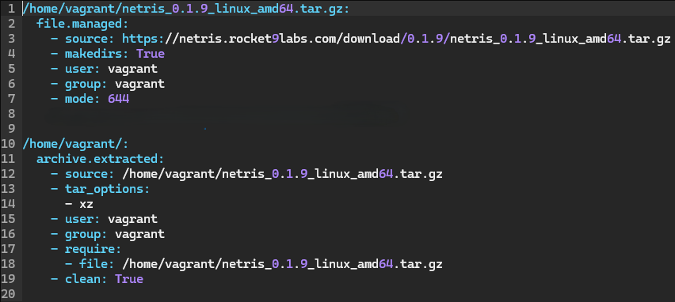

Tämän sisällön jälkeen lähdin ajamaan pakettia `sudo salt '*' state.apply netris` komennolla. Käytin '*' ihan tietoisesti, koska vain yksi orjakone oli pystyssä.


Virhettä pukkaa, mutta virheissä oli aika selkeät kommentit mitä tehdä. Lähdin pilkkomaan korjaamista kahteen osaan, ettei sekoteta enempää pakkaa. Valitsin file.managed korjaamiselle skip_verify vaihtoehdon ja kävin lisäämässä sen init.sls tiedostoon.


Ja kun suoritellaan taas ohjelmistoa.


Tila onnistunut, hienoa. Korjataan seuraavaksi archive.extracted tilan virhe, kuten söytteestäkin näkee niin enforce_toplevel pitäisi korjata virhe. Hieman lueskelin tarkemmin vielä mitä funktiota sillä on, niin enforce_toplevel=false sallii arkistojen purkamisen, vaikka niissä olisi tiedostoja tai hakemistoja juuritasolla.


Ja nyt kun ajetaan vielä uudestaan, pitäisi olla onnistunut lopputulos lataamisen ja purkamisen osalta.


Hienoa, toimii. Tähän asti olinkin aika hyvin kartalla, miten lähestyä suorittamista. Ohjelman suorittaminen olikin sitten ihan toinen asia, selvää oli itselle se, että cmd.run käyttämällä saadaan ohjelma pyörähtämään käyntiin, mutta epäselvää oli se miten sitä edeltävä ssh-keygen saataisiin taklattua. Kysyin apua herra tekoälyltä, tässä tapauksessa Gemini 2.5. Syötteeksi Geminille annoin seuraavat työkalut:

- Tiedot projektistani tähän mennessä.
- Komennot, miten lokaalisti saadaan käyntiin eli ssh-keygen ja sen jälkeen ./netris-server...
- Tavoite siitä, mitä projektin pitäisi tehdä

Tekoälyltä palautteena saatiin setti, missä:
- **file.directory** varmastaa, että .ssh hakemisto on olemassa
- **cmd.run** suorittaa ssh-keygen komennon
- **cmd.run** laittaa serverin pystyyn ./netris-server... komennolla

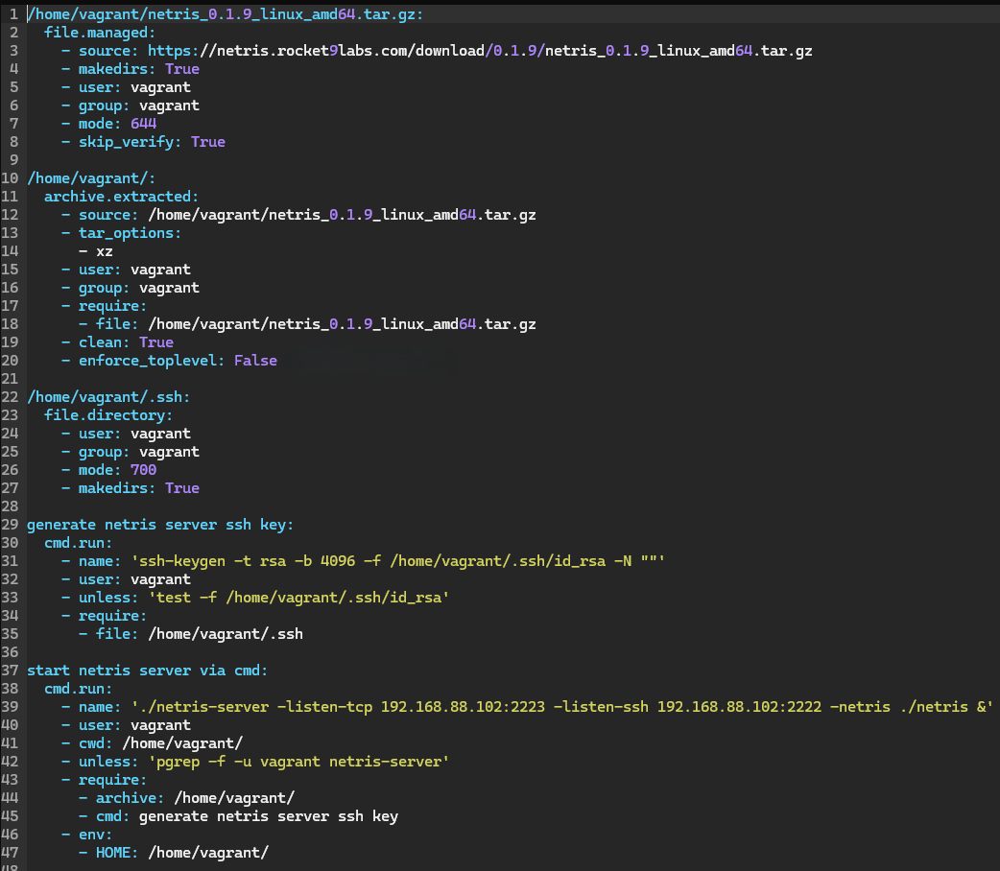

Ja kun ajetaan kokonaisuutta:

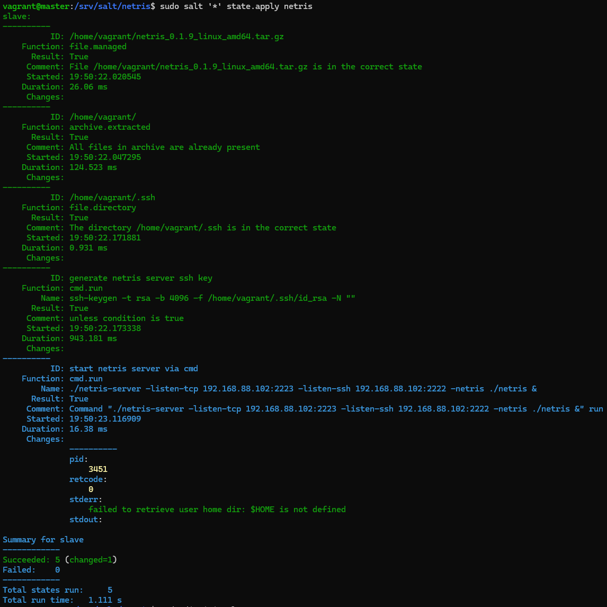

Pääosin toimiva setti. Ongelmaksi tässä kuitenkin osoittautui cmd.run, minkä pitäisi suorittaa ./netris-server komento. Jumppasin tätä tunteja, ilman tekoälyä ja tekoälyn kanssa. Mitä enemmän jumppasin, sitä enemmän solmuun tilanne meni. Viimeisimmässä vedoksessa lopputilanne oli tämä:

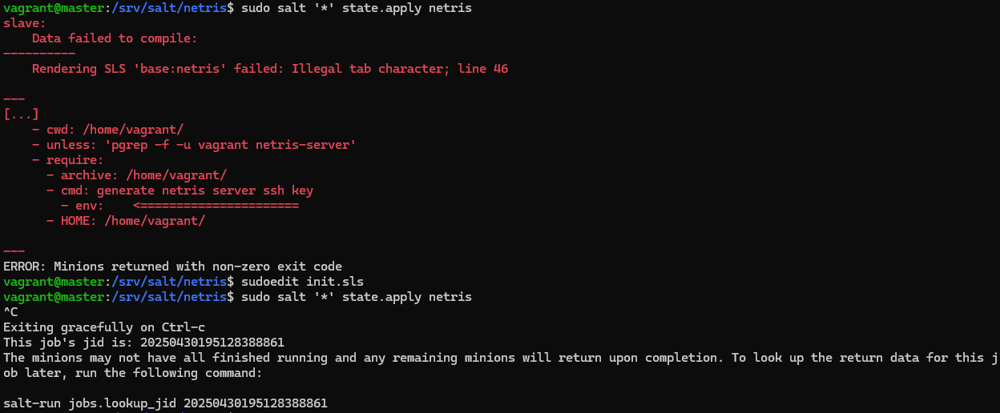

state.apply jäi jumiin suorittamaan/roikkumaan niin pitkäksi aikaa, että se piti cancelaa ctrl-c komennolla ja minion meni täysin solmuun. Lopulta Geminikin tuntui luovuttavan ja kiersi vastauksissa ympyrää, mutta tarjoten kuitenkin viimeisen suosituksen:

Gemini 2.5: "Vahva suositus: Suosittelen systemd-lähestymistapaa. Se on oikea työkalu tähän tarkoitukseen Saltilla, ja se ratkaisee tämän roikkumisongelman."

Itsehän luonnollisesti kysyin ensimmäisenä, että mikä ihmeen systemd-lähestymistapa? Kyllä se jossain vastauksissa tuli jo aikaisemmin ehdotuksena, mutta näytti asialta mitä kurssin aikana ei oltu opittu niin sivuutin aikasemmin. Mitään muita vaihtoehtoja ei kuitenkaan enää ollut, kuin lähteä kokeilemaan. Tässä alla Geminin ohjeistuksella, mitä asia tarkoittaa:

`sudo mkdir -p /srv/salt/netris/files` luodaan hekmisto ja sinne sisään **netris-server.service** tiedosto, joka toimii systemd-palvelumääritystiedostona, joka kopioidaan minionille käyttöön. Tiedostoon sisään laitettiin seuraavat asiat:

```
[Unit]
Description=Netris Server
After=network.target

[Service]
User=vagrant
WorkingDirectory=/home/vagrant/
ExecStart=/home/vagrant/netris-server -listen-tcp 192.168.88.102:2223 -listen-ssh 192.168.88.102:2222 -netris /home/vagrant/netris
Restart=on-failure
StandardOutput=syslog
StandardError=syslog
SyslogIdentifier=netris-server

[Install]
WantedBy=multi-user.target
```
Tässä pystytetään service, mistä löytyy Netris-Serveriin tarvittavat tiedot ja käynnistysargumentit.

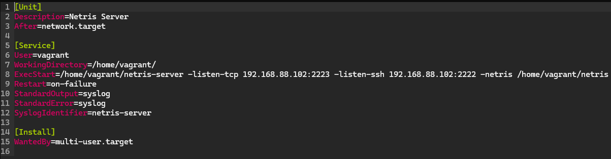

Seuraavaksi lähdettiin muokkaamaan alkuperäistä Netris init.sls tiedostoa vastaamaan uutta systemd-lähestymistapaa.

```
/home/vagrant/netris_0.1.9_linux_amd64.tar.gz:
  file.managed:
    - source: https://netris.rocket9labs.com/download/0.1.9/netris_0.1.9_linux_amd64.tar.gz
    - makedirs: True
    - user: vagrant
    - group: vagrant
    - mode: 644
    - skip_verify: True

/home/vagrant/:
  archive.extracted:
    - source: /home/vagrant/netris_0.1.9_linux_amd64.tar.gz
    - tar_options:
      - xz
    - user: vagrant
    - group: vagrant
    - require:
      - file: /home/vagrant/netris_0.1.9_linux_amd64.tar.gz
    - clean: True
    - enforce_toplevel: False

/home/vagrant/.ssh:
  file.directory:
    - user: vagrant
    - group: vagrant
    - mode: 700
    - makedirs: True

generate netris server ssh host key:
  cmd.run:
    - name: 'ssh-keygen -t rsa -b 4096 -f /home/vagrant/.ssh/id_rsa -N ""'
    - user: vagrant
    - unless: 'test -f /home/vagrant/.ssh/id_rsa'
    - require:
      - file: /home/vagrant/.ssh

/home/vagrant/.ssh/id_rsa:
  file.managed:
    - user: vagrant
    - group: vagrant
    - mode: 600
    - require:
      - cmd: generate netris server ssh host key
      - file: /home/vagrant/.ssh

/home/vagrant/.ssh/id_rsa.pub:
  file.managed:
    - user: vagrant
    - group: vagrant
    - mode: 644
    - require:
      - cmd: generate netris server ssh host key
      - file: /home/vagrant/.ssh

/etc/systemd/system/netris-server.service:
  file.managed:
    - source: salt://netris/files/netris-server.service
    - user: root
    - group: root
    - mode: 644
    - require:
      - archive: /home/vagrant/

run netris server service:
  service.running:
    - name: netris-server
    - enable: True
    - watch:
      - file: /etc/systemd/system/netris-server.service
    - require:
      - file: /etc/systemd/system/netris-server.service
      - cmd: generate netris server ssh host key
      - archive: /home/vagrant/
      - file: /home/vagrant/.ssh/id_rsa
      - file: /home/vagrant/.ssh/id_rsa.pub
```
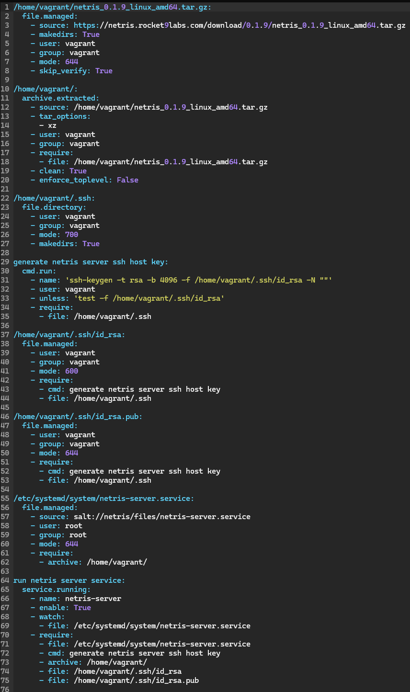

Alkuperäiset lataamiseen ja purkamiseen liittyvät asiat pysyivät samana. Myös ssh generoidaan edelleen cmd.run hyödyntäen. Tämän lisäksi tuli uusia asioita kuten:
- id_rsa **file.managed:** varmistaa id_rsa -tiedoston oikean omistajuuden ja oikeudet
- id_rsa.pub **file.managed:** varmistaa id_rsa.pub -tiedoston oikean omistajuuden ja oikeudet
- netris-server.service **file.managed:** Tila systemd-palvelutiedostojen luomiseksi minionille
- run netris server service **service.running:** Tila netris server -palvelun hallitsemiseksi systemd tavalla

Eksoottista ja itselle ainakin melko monimutkainen paketti, mutta mitään hävittävää ei enää selvittelyjen jälkeen ollut. Ajetaanpa tila orjalle ja katsotaan miten käy. 

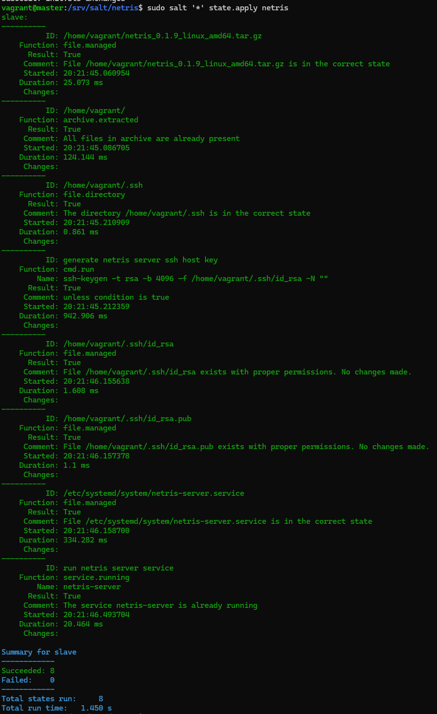

Hei! Kaikki onnistuneesti. Toimiiko idempotentti? Ajetaan uudestaan vielä.

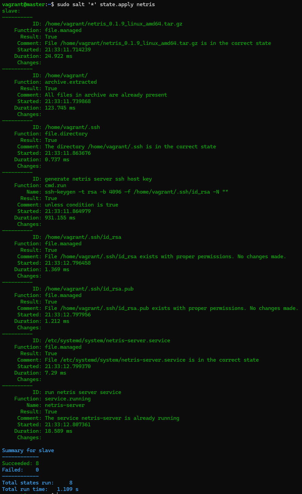

Toimii! Tarkastellaanpa vielä, onko serveri todella käynnissä. Käytännössä suoraan host koneen cmd kautta pitäisi ssh yhteydellä päästä pelaamaan `ssh vagrant@192.168.88.102 -p 2222` komennolla. 

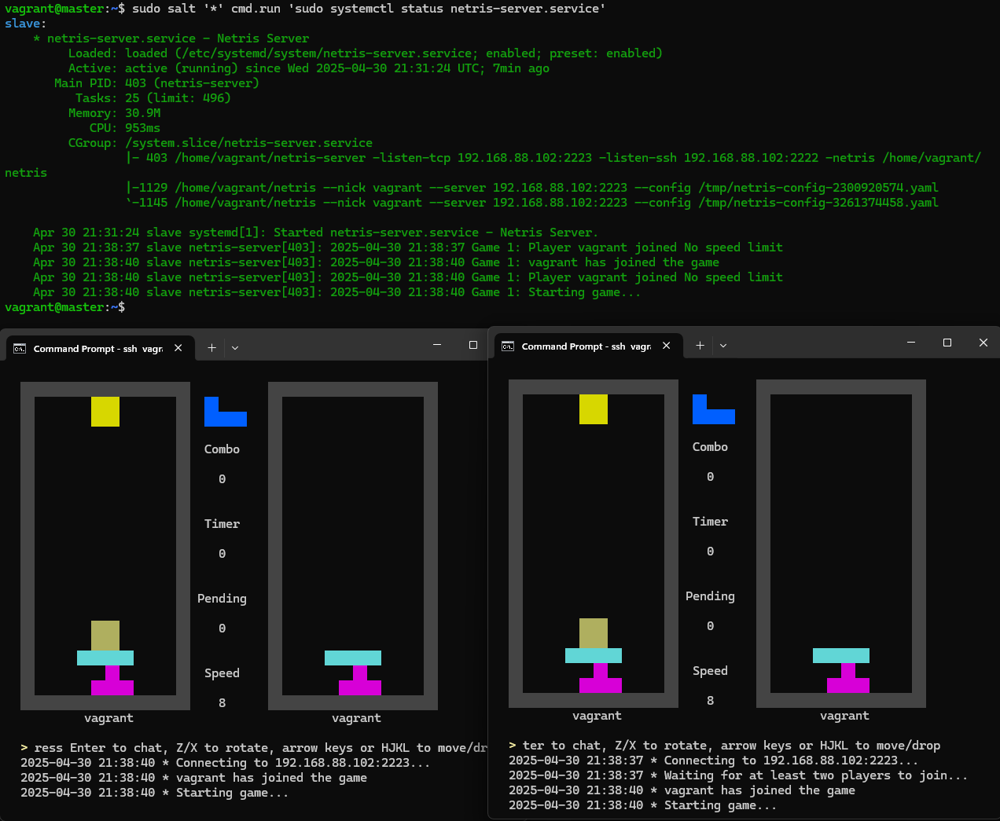

Hommahan toimii ja systemctl komennolla nähdään, miten serveri on pystyssä ja antaa dataa yhdistäneistä pelaajista!

## b) Etusivu
Loin uuden GitHub Repositorion [netris-salt-vagrant-module](https://github.com/nurminenkasper/netris-salt-vagrant-module) mihin vein projektiin liittyvät tiedot ja tein ohjeet, miten käyttö toimii. Alkuperäiseen tehtävässä käytettyyn Vagrantfile tiedostoon tein vielä yhden muutoksen, jotta kun repositorion kloonaa ja ajaa Vagrantilla saa myös mukana tulevat salt kansiot käyttöön. Vagrantfilessä "master" koneen alle seuraava linja:

      master.vm.synced_folder "salt/", "/srv/salt", owner: "root", group: "root"

Nyt kun testataan vielä käytännössä, pystyykö ulkopuolinen suorittamaan ohjelman toimivaksi. Aloitin kloonaamalla luodun repositorion koneelleni `git clone https://github.com/nurminenkasper/netris-salt-vagrant-module.git` komennolla ja tämän jälkeen valitsin `cd` komennolla kansion, mistä löytyy kaikki oleellinen suorittamista varten.

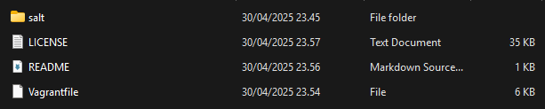

Ja kun kansiossa ajetaan komennolla `vagrant up` koneet käyntiin ja kirjaudutaan masterille `vagrant ssh master` komennolla niin päästään hommiin. Pitää toki vielä ensin hyväksyä orjan avain käyttöön `sudo salt-key -A` komennolla. Kuvassa vielä tarkistin `ls -l /srv/` komennolla, että kopioituihan tarvittavat tiedostot mukana Vagrant koneelle.

Lopulta vain kovaa ajoa `sudo salt '*' state.apply netris` komennolla.

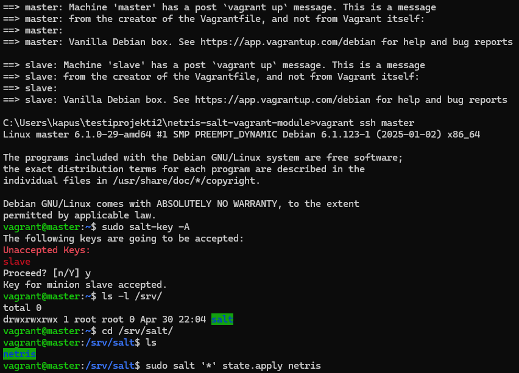

Ja hommahan suoriutui syötteen perusteella viidessä sekunnissa onnistuneesti.

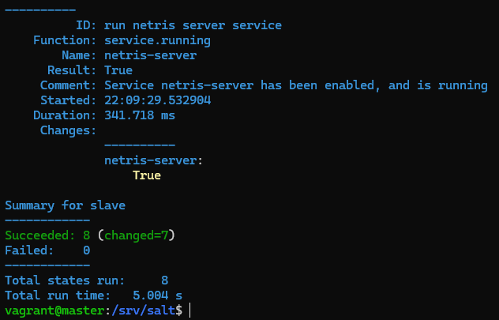

Ja kun tarkastellaan onko serveri käynnistynyt, nähdään sen olevan pystyssä onnistuneesti.

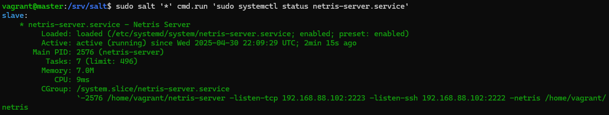

Pyörittelin vielä tämän osuuden muutamaan kertaan, että homma toimii varmasti ja ainakin itse sain joka kerta pelittämään. 

Tarpeellinen ohjelmiston toiminnan kannalta? Eipä juuri, mutta ihan mielenkiintoinen projekti oli. Ei muuta kuin Tetrikset käyntiin kaverien kanssa!

**Tehtävän lopetusaika 1.5.2025 kello XX:XX. Aktiivista työskentelyä yhteensä noin X tuntia XX minuuttia.**

## Lähteet
Karvinen T 2025. h5 Miniprojekti. Luettavissa: https://terokarvinen.com/palvelinten-hallinta/ Luettu 29.4.2025

Warmchang 2023. Netris GitHub. Luettavissa: https://github.com/warmchang/netris Luettu 30.4.2025

Rocket9labs. Netris Download. Luettavissa: https://netris.rocket9labs.com/download/?sort=name&order=desc Luettu 30.4.2025

Karvinen T 2023. Infra as Code - Your wishes as a text file. Luettavissa: https://terokarvinen.com/2024/hello-salt-infra-as-code/ Luettu 30.4.2025

Kasper Nurminen GitHub. Luettavissa: https://github.com/nurminenkasper/Palvelinten-Hallinta/blob/main/h2/h2-Soitto-kotiin.md Luettu 30.4.2025

Salt Project 2025. Managing systems with Salt SSH. Luettavissa: https://docs.saltproject.io/salt/user-guide/en/latest/topics/salt-ssh.html Luettu 30.4.2025

Salt Project 2025. Extract an archive. Luettavissa: https://docs.saltproject.io/en/3006/ref/states/all/salt.states.archive.html Luettu 30.4.2025

Salt Project 2025. Operations on regular files, special files, directories, and symlinks. Luettavissa: https://docs.saltproject.io/en/3006/ref/states/all/salt.states.file.html Luettu 30.4.2025

Salt Project 2025. Starting Or Restarting Of Services And Daemons. Luettavissa: https://docs.saltproject.io/en/3006/ref/states/all/salt.states.service.html Luettu 30.4.2025

Tämän sisällön tuottamisessa on hyödynnetty Gemini 2.5 -kielimallia. Käytettyjä syötteitä on avattu tekstissä.


