# h5 Miniprojekti

## Rauta & HostOS

- Asus X570 ROG Crosshair VIII Dark Hero AM4
- AMD Ryzen 5800X3D
- G.Skill DDR4 2x16gb 3200MHz CL16
- 2x SK hynix Platinum P41 2TB PCIe NVMe Gen4
- Sapphire Radeon RX 7900 XT NITRO+ Vapor-X
- Windows 11 Home 24H2

**Tehtävän aloitusaika 30.4.2025 kello 08:00**

## a) Oma miniprojekti
Tehtävää varten piti vähän mietiskellä, millaista projektia lähden toteuttamaan. Lopulta päädyin ratkaisuun, missä pystytän Saltin yli serverin Multiplayer Tetris klooninlle nimeltä [Netris](https://github.com/warmchang/netris). Tätä oli kuitenkin tarpeellista lähteä testaamaan ensin lokaalisti, että nähdään saadaanko se ylipäätänsä toimimaan. Aihe oli entuudestaan jo hieman tuttu, mikä helpotti lokaalia suorittamista.

Rakentelin Vagrantilla Master ja Slave koneet pystyyn. Alla olevaa Vagrantfileä hyödyntäen saadaan rakennettua koneet pystyyn niin, että Masterille jää jäljelle enään salt-avaimen hyväksyntä käynnistellessä.

```
$master_script = <<-MASTER_SCRIPT
set -o verbose
sudo apt-get update
sudo apt-get install -y curl tree
sudo mkdir -p /etc/apt/keyrings
sudo curl -fsSL https://packages.broadcom.com/artifactory/api/security/keypair/SaltProjectKey/public | sudo tee /etc/apt/keyrings/salt-archive-keyring.pgp
sudo curl -fsSL https://github.com/saltstack/salt-install-guide/releases/latest/download/salt.sources | sudo tee /etc/apt/sources.list.d/salt.sources
sudo apt-get update
sudo apt-get install -y salt-master
sudo systemctl restart salt-master.service
MASTER_SCRIPT

$minion_script = <<-MINION_SCRIPT
set -o verbose
sudo apt-get update
sudo apt-get install -y curl tree
sudo mkdir -p /etc/apt/keyrings
sudo curl -fsSL https://packages.broadcom.com/artifactory/api/security/keypair/SaltProjectKey/public | sudo tee /etc/apt/keyrings/salt-archive-keyring.pgp
sudo curl -fsSL https://github.com/saltstack/salt-install-guide/releases/latest/download/salt.sources | sudo tee /etc/apt/sources.list.d/salt.sources
sudo apt-get update
sudo apt-get install -y salt-minion
echo -e 'master: 192.168.88.101' |sudo tee /etc/salt/minion
sudo systemctl restart salt-minion.service
MINION_SCRIPT

Vagrant.configure("2") do |config|
   config.vm.synced_folder ".", "/vagrant", disabled: true
   config.vm.synced_folder "shared/", "/home/vagrant/shared", create: true
   config.vm.box = "debian/bookworm64"

   config.vm.define "master" do |master|
      master.vm.hostname = "master"
      master.vm.network "private_network", ip: "192.168.88.101"
      master.vm.provision "shell", inline: $master_script
   end

   config.vm.define "slave", primary: true do |slave|
      slave.vm.hostname = "slave"
      slave.vm.network "private_network", ip: "192.168.88.102"
      slave.vm.provision "shell", inline: $minion_script
   end
end
```

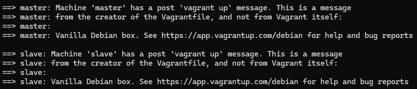
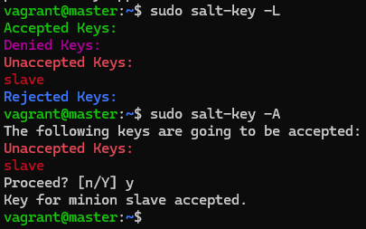

Netris tarjoaa suorat Linux binäärit ladattavana sivuiltaan, joten haetaan ja puretaan ne käyttöön wget & tar komennoilla.

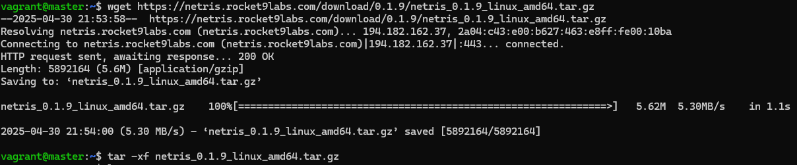

Puretusta sisällöstä löytyy markdown tiedostojen lisäksi kaksi suoritettavaa ohjelmistoa. Netris ja Netris-Server. Näistä enemmän kiinnostuneita olemme netris-serveristä, koska tavoitteena on pystyttää Netris-Server SSH yli toimivaksi ja sen jälkeen pelata sitä. Itse pelaamiseen käyttäjä ei tarvitse muuta kuin SSH yhteyden serverille. 

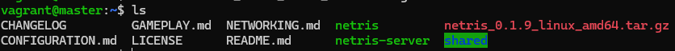

`./netris-server --help` antaa tarpeellista tietoa siitä, miten itse serveri saadaan käyntiin. 

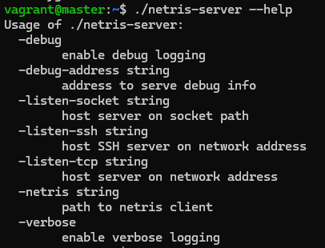

Itse tiesin jo entuudestaan, että suorittamiseen vaaditaan TCP ja SSH molemmat. CONFIGURATION.md puolestaan mainitsi vielä sen, että perään kannattaa lisätä -netris + polku ohjelmaan.

`./netris-server -listen-tcp 192.168.88.101:2223 -listen-ssh 192.168.88.101:2222 -netris ./netris` serveri käyntiin.

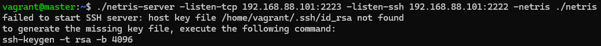

Host keytä ei tosissaan löytynyt, joten generoidaan vielä se ennen suorittamista.

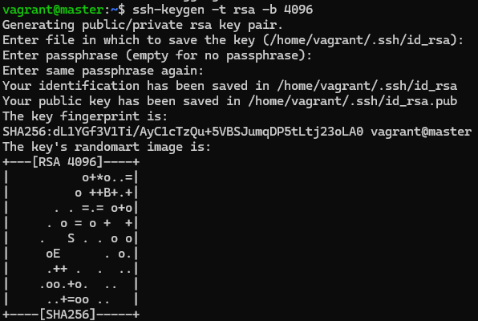

Homma käyntiin uudestaan onnistuneesti ja avasin toiseen terminaaliin Slave koneen, mistä muodostin onnistuneen SSH yhteyden Masterille, missä nyt tällä kertaa Serveri pyöri.

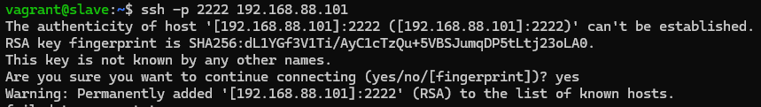
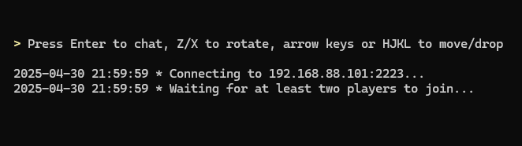

Peli olisi vaatinut vielä toisen yhteydenottajan, testasinkin sitä lopulta ihan oman host koneen CMD kautta, mutta kuva unohtui ottaa väliin sekaan. Master koneen syötteestä nähdään kuitenkin se, että serveri on pystyssä ja pelaaja vagrant liittyi serverin peliin.

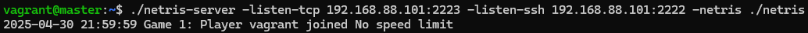

Seuraavaksi edessä oli selvitellä, miten homma saataisiin pyöritettyä ympäri niin, että Master ajaa Saltin yli Slavelle serverin pystyyn. Puhdistin tätä varten Vagrant masiinat ja lähdin toteuttamaan projektia puhtaalta pöydältä. Koneet nostin pystyyn ylempänä kuvatulla tavalla, joten niitä turha toistaa tähän. Lähdin rakentamaan kokonaisuutta master koneella infraa koodina tyyppisesti:

      sudo mkdir -p /srv/salt/netris
      sudoedit /srv/salt/netris/init.sls

init.sls tiedostoon lähdin rakentamaan asiaa kahdessa osassa. Aluksi halusin saada toimimaan sen, että minion hakee latauslinkistä tar tiedoston jonka jälkeen se purkaa sen käyttöön. Ensimmäisessä vedoksessa hyödynnettiin file.managed tilaa lataamaan itse tiedosto ja sen jälkeen archive.extracted purkamaan se.

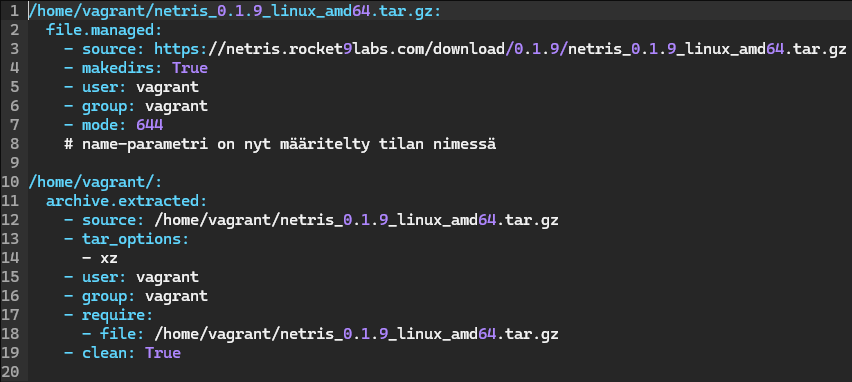

Tämän sisällön jälkeen lähdin ajamaan pakettia `sudo salt '*' state.apply netris` komennolla. Käytin '*' ihan tietoisesti, koska vain yksi orjakone oli pystyssä.

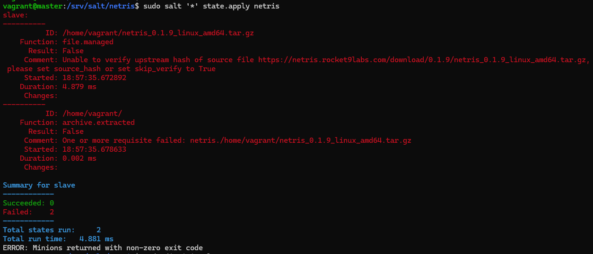

Virhettä pukkaa, mutta virheissä oli aika selkeät kommentit mitä tehdä. Lähdin pilkkomaan korjaamista kahteen osaan, ettei sekoteta enempää pakkaa. Valitsin file.managed korjaamiselle skip_verify vaihtoehdon ja kävin lisäämässä sen init.sls tiedostoon.

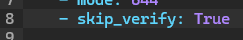

Ja kun suoritellaan taas ohjelmistoa.

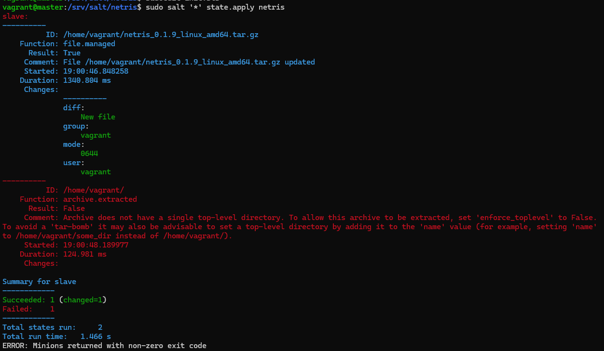

Tila onnistunut, hienoa. Korjataan seuraavaksi archive.extracted tilan virhe, kuten söytteestäkin näkee niin enforce_toplevel pitäisi korjata virhe. Hieman lueskelin tarkemmin vielä mitä funktiota sillä on, niin enforce_toplevel=false sallii arkistojen purkamisen, vaikka niissä olisi tiedostoja tai hakemistoja juuritasolla.

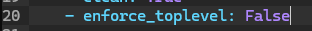

Ja nyt kun ajetaan vielä uudestaan, pitäisi olla onnistunut lopputulos lataamisen ja purkamisen osalta.

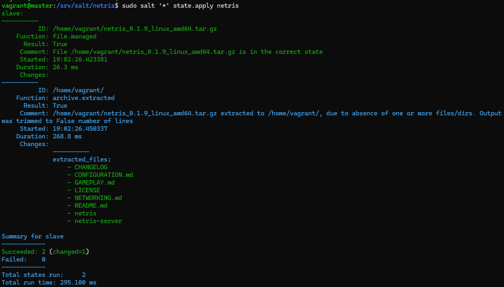


## b) Etusivu


**Tehtävän lopetusaika 1.5.2025 kello XX:XX. Aktiivista työskentelyä yhteensä noin X tuntia XX minuuttia.**

## Lähteet
https://terokarvinen.com/palvelinten-hallinta/

https://github.com/warmchang/netris

https://netris.rocket9labs.com/download/0.1.9/netris_0.1.9_linux_amd64.tar.gz

https://terokarvinen.com/2024/hello-salt-infra-as-code/

https://github.com/nurminenkasper/Palvelinten-Hallinta/blob/main/h2/h2-Soitto-kotiin.md

https://docs.saltproject.io/salt/user-guide/en/latest/topics/salt-ssh.html

https://docs.saltproject.io/en/3006/ref/states/all/salt.states.archive.html
